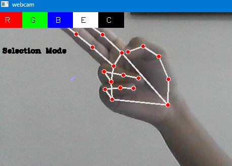
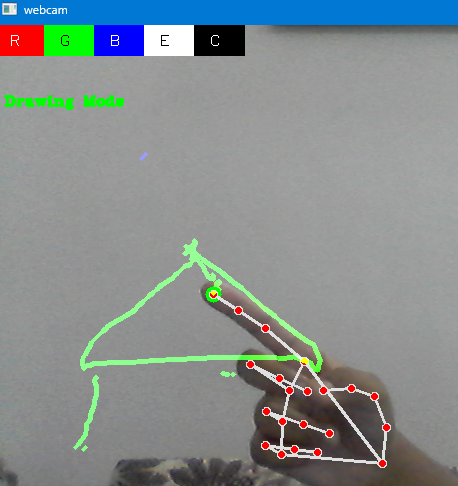
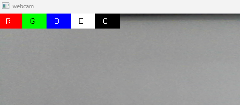

#  Air Canvas using OpenCV & MediaPipe

Air Canvas is a Computer Vision project that allows users to draw in the air using hand gestures captured through a webcam. The project uses OpenCV for image processing and MediaPipe for real-time hand tracking.

##  Features

* Real-Time Hand Detection
* Hand Skeleton Tracking
* Fingertip Tracking
* Drawing Mode
* Selection Mode
* Color Picker

  * 🔴 Red
  * 🟢 Green
  * 🔵 Blue
* Eraser Tool
* Clear Canvas
* Save Drawing as Image
* Coordinate Smoothing for Better Drawing Experience

---

##  Technologies Used

* Python
* OpenCV
* MediaPipe

---

##  Project Screenshots

## Hand Detection & Selection Mode



## Drawing Mode



## Toolbar & Tools



---

##  How It Works

1. Webcam captures video frames.
2. MediaPipe detects the hand and tracks 21 landmarks.
3. The index finger tip is used as the drawing pointer.
4. Different finger combinations are used to switch between modes:

   * Index Finger Up → Drawing Mode
   * Index + Middle Finger Up → Selection Mode
5. Users can select colors, erase drawings, clear the canvas, and save their work.

---

##  What I Learned

Through this project, I learned:

* Basics of OpenCV and real-time video processing.
* Hand tracking using MediaPipe.
* Working with landmarks and coordinate mapping.
* Gesture recognition using hand landmark positions.
* Managing application states such as Drawing Mode and Selection Mode.
* Using a separate canvas to maintain drawings.
* Implementing color selection and tool switching.
* Improving drawing quality using coordinate smoothing.
* Debugging real-world issues while developing a Computer Vision application.

---

##  Challenges Faced

Some of the challenges I faced while building this project:

* MediaPipe compatibility issues with newer Python versions.
* Setting up and managing virtual environments.
* Webcam freezing when hand tracking started.
* Infinite loop bugs during development.
* Converting normalized coordinates into screen coordinates.
* Making drawings persist across frames.
* Implementing a working eraser tool.
* Reducing shaky drawings caused by hand tracking jitter.
* Debugging gesture recognition and tool selection logic.

---

## 📂 Project Structure

```text
airdraw-canvas/
│
├── assets/
├── docs/
│   └── learning-notes.md
├── src/
│   └── main.py
├── requirements.txt
├── README.md
└── drawing.png
```

---

## 🎯 Future Improvements

* Brush Size Control
* Additional Color Options
* Better Smoothing Algorithms
* Shape Drawing Tools (Line, Rectangle, Circle)
* Mobile Camera Support
* Improved User Interface
* Gesture Shortcuts for Tools
* Export Drawings in Different Formats

---

## 💡 Key Takeaway

This project helped me understand that building a working application is not just about writing code—it also involves debugging, testing, problem-solving, and continuously improving the implementation.

---


